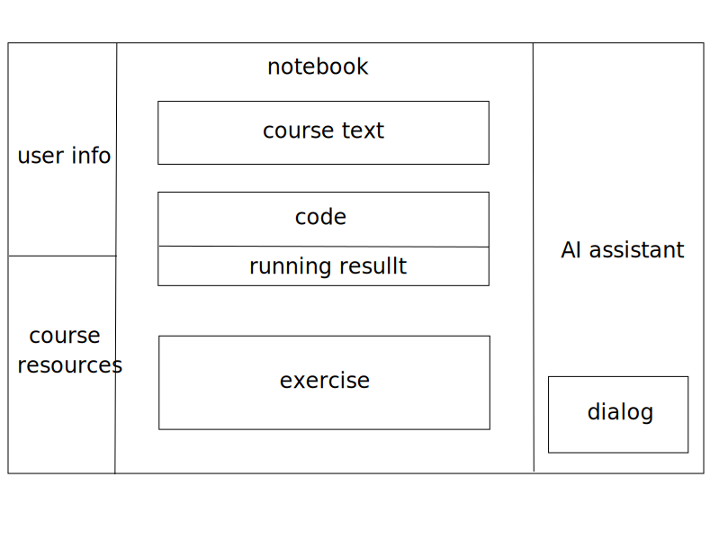

# [CS304] Team Project - Sprint 1 - team 36

### Group Members -- 施米乐 王宇航 范升泰 王玺华 王梓鑫

### Architectural Design

#### Why bother using commands while we have views?

- Decouple logic from UI
  - By defining the core logic in commands, we can easily link those commands to UI components, such as buttons or input boxes, that VSCode provides. This eliminates the need to replicate the underlying logic when developing the UI, ensuring a more modular and maintainable codebase.
- Help debugging and accelerate UI development
  - Once the commands are tested and functioning, adding a user interface becomes a simple task of connecting the existing commands to the corresponding components. This not only accelerates development but also ensures that the logic remains consistent across both the command-line and UI-driven workflows.

### UI Design

**Implemented:**
- User login and registration
- Course resource management
- Upload and update of course resources

**In Development:**
- Custom notebook interface, initially supporting Python code, markdown, output results, and exercises (four types of cells)
- Real-time execution of course code and feedback on results; currently able to retrieve code execution results and custom outputs
- Collaborative programming interface, including a chat box setup

**Future Design:**
- Adding an AI assistant in the sidebar for users to ask about course content at any time
- Real-time progress tracking of course assignments via a progress bar
### 
